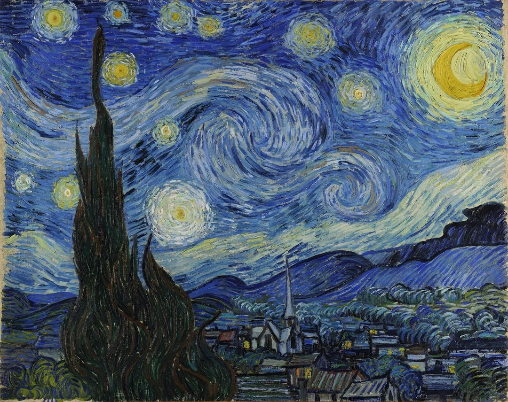

### About me



- 🌱&ensp;I’m currently learning ▇▇▇

- 🔭&ensp;Life blog：[blog.dongcp.top](https://blog.dongcp.top)

- 💻&ensp;Tech blog：[simeis147.github.io](https://simeis147.github.io)

- ⚙️&ensp;Interested in digital products, recently obsessed with [keyboards](https://www.zfrontier.com/app/user/zae5QEwJmVroZk)

- 🌊&ensp;The goals for 2025 is ▇▇▇▇▇▇

- 🌠&ensp;On the right is Van Gogh's《The Starry Night》

### Github summary

<div align="center"> 


</div>

<details>
<summary>📑 More</summary>
</br> 

<div align="center"> 
  
[](https://github.com/ryo-ma/github-profile-trophy)


</div>

<!--  [](https://github.com/anuraghazra/github-readme-stats) -->
  
<!-- [](https://github.com/ashutosh00710/github-readme-activity-graph) -->
  
</details>

### Waka stats

[](https://wakatime.com/@fa238767-d1b2-496a-b6a7-115d077fa4e0)

<details>
<summary>📑 More</summary>
</br>

<!--START_SECTION:waka-->


**I'm an Early 🐤** 

```text
🌞 Morning                142 commits         ███░░░░░░░░░░░░░░░░░░░░░░   13.52 % 
🌆 Daytime                535 commits         █████████████░░░░░░░░░░░░   50.95 % 
🌃 Evening                286 commits         ███████░░░░░░░░░░░░░░░░░░   27.24 % 
🌙 Night                  87 commits          ██░░░░░░░░░░░░░░░░░░░░░░░   08.29 % 
```
📅 **I'm Most Productive on Tuesday** 

```text
Monday                   162 commits         ████░░░░░░░░░░░░░░░░░░░░░   15.43 % 
Tuesday                  203 commits         █████░░░░░░░░░░░░░░░░░░░░   19.33 % 
Wednesday                136 commits         ███░░░░░░░░░░░░░░░░░░░░░░   12.95 % 
Thursday                 139 commits         ███░░░░░░░░░░░░░░░░░░░░░░   13.24 % 
Friday                   181 commits         ████░░░░░░░░░░░░░░░░░░░░░   17.24 % 
Saturday                 111 commits         ███░░░░░░░░░░░░░░░░░░░░░░   10.57 % 
Sunday                   118 commits         ███░░░░░░░░░░░░░░░░░░░░░░   11.24 % 
```


📊 **This Week I Spent My Time On** 

```text
🕑︎ Time Zone: Asia/Shanghai

💬 Programming Languages: 
No Activity Tracked This Week

🔥 Editors: 
No Activity Tracked This Week

🐱‍💻 Projects: 
No Activity Tracked This Week

💻 Operating System: 
No Activity Tracked This Week
```

**I Mostly Code in Java** 

```text
Java                     5 repos             ██████████░░░░░░░░░░░░░░░   38.46 % 
JavaScript               4 repos             ████████░░░░░░░░░░░░░░░░░   30.77 % 
TypeScript               3 repos             ██████░░░░░░░░░░░░░░░░░░░   23.08 % 
CSS                      1 repo              ██░░░░░░░░░░░░░░░░░░░░░░░   07.69 % 
```


<!--END_SECTION:waka-->

</details>

### Visitor count

<div align="center">

[](https://github.com/journey-ad/Moe-Counter)

</div>
